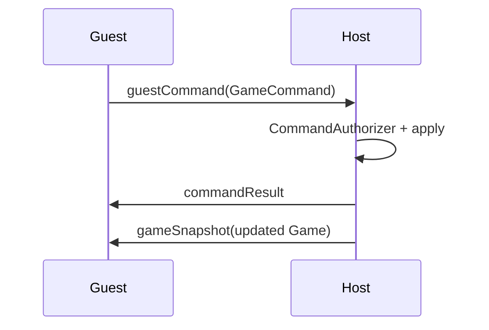

# Wizard Multiplayer — Wire Protocol Reference

`WireProtocolVersion.current` is **1**. Messages are wrapped in `WireEnvelope { version, payload }`.

## WirePayload cases

| Payload | Direction / purpose |
|---------|---------------------|
| `hello` | Session handshake |
| `joinLobby` | Guest requests join with session code |
| `claimPlayer` | Guest claims a player slot / sets display name |
| `claimAccepted` | Host confirms player claim |
| `joinAccepted` | Join succeeded; may include initial state hints |
| `joinRejected` | Join failed (bad code, full lobby, etc.) |
| `gameSnapshot` | Host → guests: authoritative `Game` JSON/state |
| `guestCommand` | Guest → host: proposed `GameCommand` |
| `commandResult` | Host → guest: accept/reject + optional error |
| `sessionEnded` | Host ended session |
| `ping` / `pong` | Keepalive |

Payload encoding uses a `type` discriminator key plus a nested message object (see `WirePayload` `Codable` in `WireProtocol.swift`).

## Guest command flow

## Testing

- `Tests/WizardNetTests/CommandAuthorizerTests.swift` — allow/deny matrix
- `Tests/WizardNetTests/SessionSyncTests.swift` — snapshot/command integration
- `Tests/WizardNetTests/SessionCodeValidationTests.swift` — join codes

Use `MockTransport` in `Sources/WizardNet/MockTransport.swift` for unit tests without real TCP.
