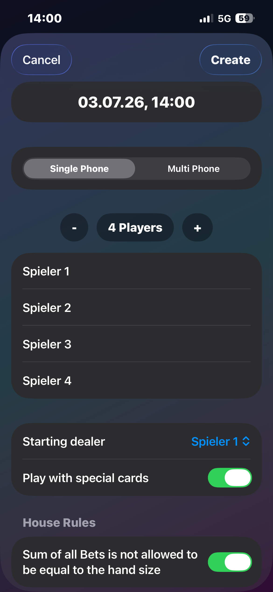
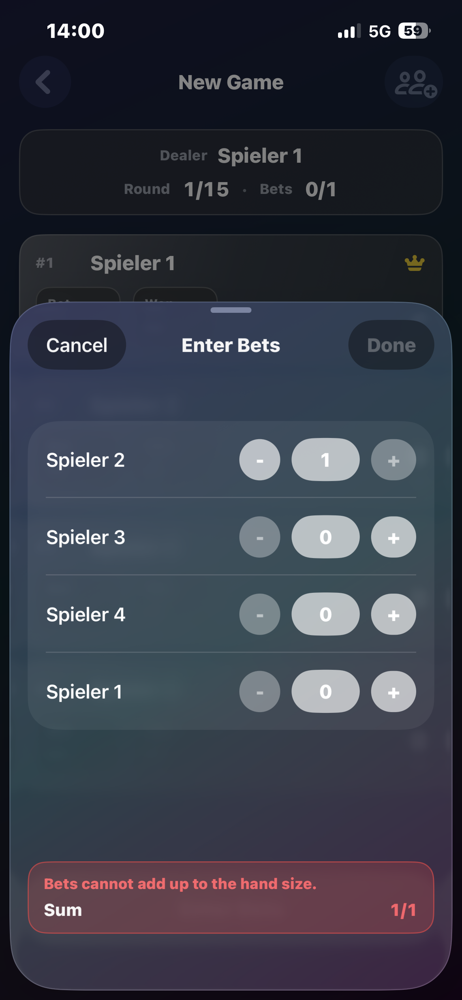
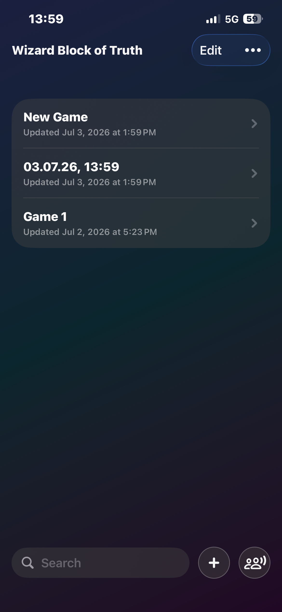

<!-- Header Section -->
<div align="center">

# 🃏 Wizard Block of Truth


<br/>

### [📲 Download on the App Store](https://apps.apple.com/app/id6761933762) · [🌐 Website](https://eliassteffen.github.io/Wizard-Block-Of-Truth/)

<br/>

The modern score sheet for Wizard nights. Replace paper chaos with a fast, transparent game flow: bids, tricks, scoring, round history, and local multiplayer in one clean app.

</div>

---

## ✨ Features

- **🃏 Track every trick** — Every game is saved on device with searchable history, timestamps, and quick resume.
- **⚡ Set up in seconds** — Create a game for 2–6 players, pick single-phone or multi-phone mode, and configure house rules before the first deal.
- **📊 Live scores, zero math** — Bids, tricks, round totals, and per-player trends on a scoreboard that updates as you play.
- **🛡 Keep every round honest** — Validation catches impossible totals early, like when the sum of bids must not equal the hand size.
- **📶 LAN multiplayer** — One device per player on the same Wi-Fi, with the host staying authoritative.

---

## 📱 Screenshots

| Game list | Create game | Scoreboard | Enter bids |
| :---: | :---: | :---: | :---: |
|  |  |  |  |

---

## 🕹️ How it works

1. **Create a game** — Choose players, dealer, special cards, and house rules. Switch to multi-phone mode when everyone has their own iPhone.
2. **Enter bids and tricks** — Step through each round with guided entry. The app validates sums and keeps the host authoritative in multiplayer.
3. **Review and continue** — Inspect round history, spot corrections, and pick up saved games whenever you return to the table.

---

## 🛠️ Development

### Prerequisites

| Software | Version |
| :--- | :--- |
| **Xcode** | 16+ |
| **iOS** | 18.0+ |

### Getting started

1. **Clone the repository**
   ```bash
   git clone https://github.com/EliasSteffen/Wizard-Block-Of-Truth.git
   ```

2. Open `Wizard-Block-Of-Truth.xcodeproj` in **Xcode** and run.

### Project structure

```
Sources/       App source code (Swift)
Tests/         Unit tests
Assets/        App assets
fastlane/      Build & release automation
screenshots/   App Store screenshots
site/          Marketing website (Astro, GitHub Pages)
```

---

## 🔒 Privacy & trust

- No ad SDKs, no custom analytics stack in this distribution.
- All game data stays on device.
- Privacy policy and support pages are available on the [website](https://eliassteffen.github.io/Wizard-Block-Of-Truth/).

> Wizard is a published card game. This app is an independent scoring tool and is not affiliated with the publisher or rights holders of the game.
